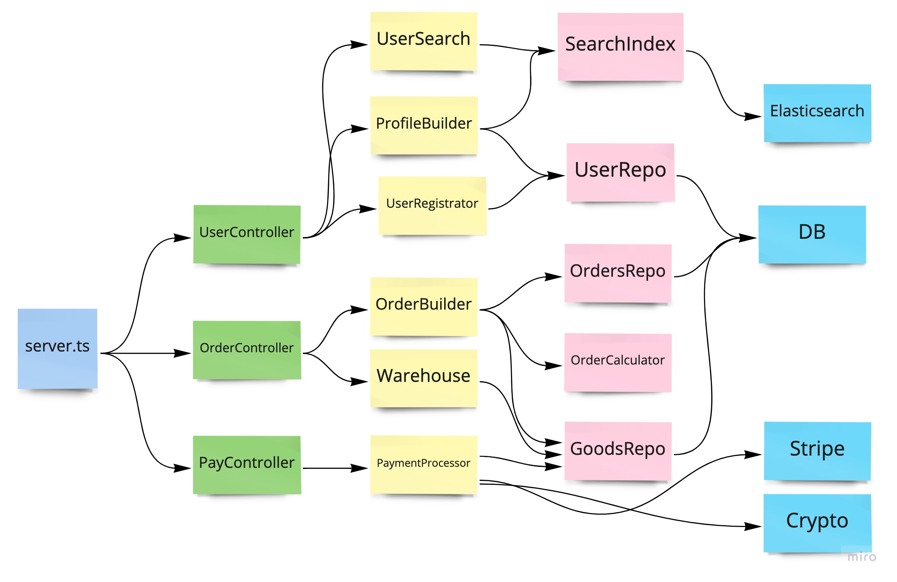

# RSDI - Dependency Injection Container

Simple and powerful dependency injection container for with strong type checking system.

- [Motivation](#motivation)
- [When to use](#when-to-use)
- [DI Container vs Context](#di-container-vs-context)
- [Architecture](#architecture)
- [Features](#features)
- [Usage](#usage)
  - [Raw values](#raw-values)
  - [Object resolver](#object-resolver)
  - [Function resolver](#function-resolver)
  - [Factory resolver](#factory-resolver)
- [Advanced Usage](#advanced-usage)
  - [Typescript type resolution](#typescript-type-resolution)
  - [Dependency declaration](#dependency-declaration)
  - [Async factory resolver](#async-factory-resolver)

## Motivation

Popular dependency injection libraries use `reflect-metadata` that allows to fetch argument types and based on
those types and do autowiring. Autowiring is a nice feature but the trade-off is decorators.

```typescript
@injectable()
class Foo {}
```

# When to use

`RSDI` is most effective in complex applications. When the complexity of your application is high, it becomes necessary to
break up huge components into smaller ones to control the complexity. You have components that use other components that
use other components. You have application layers and a layer hierarchy. There is a need to transfer dependencies from
the upper layers to the lower ones.

You like and respect and use Dependency Injection and TDD. You have to use Dependency Injection in order to have proper
unit tests. Tests that test only one module - class, component, function, but not integration with nested dependencies.

## DI Container vs Context

```typescript
export const userRegistratorFactory = (repository: UserRepository) => {};

// VS

export const userRegistratorFactory = (context: {
  repository: UserRepository;
}) => {};
```

At first glance, the difference is not that big. Context works great when the number of dependencies in your application is
low. When a context starts storing a lot of dependencies, it becomes more difficult to use it. The context can be
structured i.e. `context: { users: { repository: UserRepository } }`, this will partially solve the problem, but moving
the component inside the context structure becomes a costly task where there are risks of errors.

When a context is passed to a component, it can use any components from the context. While this may seem like a good idea,
in big teams it can lead to redundantly cohesive project modules. Developers in different teams begin to pull everything
out of context, without thinking about the coherence in projects. Allocating a subsystem that is used by a context into
a microservice can be a much more expensive task.

## Architecture

`RSDI` expects (but does not require) that you build all your dependencies into a dependency tree. Let's take a typical
web application as an example. Given that your application is quite large and has many layers:

- controllers (REST or graphql handlers)
- domain model handlers (your domain models, various managers, use-cases etc)
- DB repositories,
- Low level services



An application always has an entry point, whether it is a web application or a CLI application. This is the only place where you
should configure your dependency injection container. The top level components will then have the lower level components
injected. The entry point is the dirtiest place in your application, but everything is clean behind it.

# How to use

Let's take a simple web application as an example. We will cut into a small part of the application that registers a
new user. A real application will consist of dozens of components. The logic of the components will be much more
complicated. This is just a demo.

```typescript
// configure Express router
export default function configureRouter(
  app: core.Express,
  diContainer: IDIContainer
) {
  const usersController = diContainer.get(UsersController);
  app
    .route("/users")
    .get(usersController.list.bind(usersController))
    .post(usersController.create.bind(usersController));
}

export function UserController(
  userRegistrator: UserRegistrator,
  userRepository: UserRepository
) {
  return {
    async create(req: Request, res: Response) {
      const user = await userRegistrator.register(req.body);
      res.send(user);
    },
    async list(req: Request) {
      const users = await userRepository.findAll(req.body);
      res.send(users);
    },
  };
}

export class UserRegistrator {
  public constructor(public readonly userRepository: UserRepository) {}

  public async register(userData: SignupData) {
    // validate
    const user = this.userRepository.saveNewUser(userData);
    // send sign up email
    return user;
  }
}

export function MyDbProviderUserRepository(db: Knex): UserRepository {
  return {
    async saveNewUser(userAccountData: SignupData): Promise<void> {
      await this.db("insert").insert(userAccountData);
    },
  };
}

export function buildDbConnection(): Knex {
  return knex({
    /* db credentials */
  });
}
```

Now we need to configure the dependency injection container before use. Dependencies are declared and not really initiated
until the application really needs them. Your DI container initialization function - `configureDI` will include:

```typescript
import DIContainer, { object, use, factory, func, IDIContainer } from "rsdi";

export default function configureDI() {
  const container = new DIContainer();
  container.add({
    buildDbConnection: factory(() => {
      buildDbConnection();
    }),
    [MyDbProviderUserRepository.name]: func(
      MyDbProviderUserRepository,
      use(buildDbConnection)
    ),
    [UserRegistrator.name]: object(UserRegistrator).contrstruct(
      use(MyDbProviderUserRepository.name)
    ),
    [UserController.name]: func(
      UserController,
      use(UserRegistrator.name),
      use(MyDbProviderUserRepository.name)
    ),
  });
  return container;
}
```

**All resolvers are resolved only once and their result persists over the life of the container.**


Add `configureDI` in the entry point of your application.

```typescript
// express.ts
const app = express();
const PORT = 8000;

const diContainer = configureDI();
configureRouter(app, diContainer);

app.listen(PORT, () => {
  console.log(`⚡️[server]: Server is running at http://localhost:${PORT}`);
});
```

The complete example can be found [here](https://radzserg.medium.com/dependency-injection-in-express-application-dd85295694ab)

## Features

- Simple but powerful
- Does not requires decorators
- Great types resolution
- Works great with both javascript and typescript

Why component Foo should know that it's injectable?

Your business logic depends on a specific framework that is not part of your domain model and can change.

More thoughts in a [dedicated article](https://radzserg.medium.com/https-medium-com-radzserg-dependency-injection-in-react-part-2-995e93b3327c)

## Usage

### Raw values

Dependencies are set as raw values. No lazy initialisation happens. Container keeps and return raw values.

```typescript
import DIContainer from "rsdi";

const container = new DIContainer();
container.add({
  ENV: "PRODUCTION",
  HTTP_PORT: 3000,
  storage: new CookieStorage(),
});
const env: string = container.get("ENV");
const port: number = container.get("HTTP_PORT");
const authStorage: AuthStorage = container.get(AuthStorage); // instance of AuthStorage
```

### Object resolver

`object(ClassName)` - constructs an instance of the given class. The simplest scenario it calls the class constructor `new ClassName()`.
When you need to pass arguments to the constructor, you can use `construct` method. You can refer to the already defined
dependencies via the `use` helper, or you can pass raw values.

If you need to call object method after initialization you can use `method` it will be called after constructor.

```typescript
// test class
class ControllerContainer {
  constructor(authStorage: AuthStorage, logger: Logger) {}

  add(controller: Controller) {
    this.controllers.push(controller);
  }
}

// container
const container = new DIContainer();
container.add({
  Storage: object(CookieStorage), // constructor without arguments
  AuthStorage: object(AuthStorage).construct(
    use(Storage) // refers to existing dependency
  ),
  UsersController: object(UserController),
  PostsController: object(PostsController),
  ControllerContainer: object(MainCliCommand)
    .construct(use(AuthStorage), new Logger()) // use existing dependency, or pass raw values
    .method("add", use(UsersController)) // call class method after initialization
    .method("add", use(PostsController)),
});
```

### Function resolver

Function resolver allows declaring lazy functions. Function will be called when it's actually needed.

```typescript
function UsersRepoFactory(knex: Knex): UsersRepo {
  return {
    async findById(id: number) {
      await knex("users").where({ id });
    },
  };
}

const container = new DIContainer();
container.add({
  DBConnection: knex(/* ... */),
  UsersRepoFactory: func(UsersRepoFactory, use("DBConnection")),
});

const userRepo = container.get(UsersRepoFactory);
```

### Factory resolver

Factory resolver is similar to a Function resolver. You can use factory resolver when you need more flexibility
during initialization. `container: IDIContainer` will be passed in as an argument to the factory method. So you can
resolve other dependencies inside the factory function.

```typescript
const container = new DIContainer();
container.add({
  BrowserHistory: factory(configureHistory),
});

function configureHistory(container: IDIContainer): History {
  const history = createBrowserHistory();
  const env = container.get("ENV");
  if (env === "production") {
    // do what you need
  }
  return history;
}
const history = container.get<History>("BrowserHistory");
```

## Advanced Usage

### Typescript type resolution


`container.get` - return type based on declaration.

- for `myName: "resolution"` - String,
- for `myName: new Date()` - Date,
- for `myName: object(Foo)` - instance of class Foo,
- for `myName: func(MyFunc)` - return type of function foo.

`contrainer.use` - allows to reference declared dependency with respect to types.

```typescript
const container: DIContainer = new DIContainer();

container.add({
  bar: new ObjectResolver(Bar),
  key1: new RawValueResolver("value1"),
});
container.add({
  foo: new ObjectResolver(Foo).construct("foo", container.use("bar")),
});
```

`use` defines allows to reference dependencies that will be defined

- if given name is class - instance of a class
- if given name is function - return type of function
- if custom generic type is provided - custom type
- otherwise - any

```typescript
class Foo {
  constructor(private readonly bar: Bar) {}
}

const container: DIContainer = new DIContainer();
container.add({
  Bar: new Bar(),
  Foo: object(Foo).construct(use(Bar)), // constuct method checks type and use return Bar type
});
```

Example: `container.get` resolve type based on a given factory return type.

```typescript
function myFactory() {
  return { a: 123 };
}
container.add({
  myFactory: factory((container: IDIContainer) => {
    return myFactory();
  }),
});
let { a } = container.get(myFactory);
```

### Dependency declaration

RSDI resolves dependencies on a given type. It can be string or function. In the simplest case, you can use strings.

```typescript
container.add({
  Foo: new Foo(),
});
const foo = container.get<Foo>("Foo");
```

You can use function or class names by declaring them as `[MyClass.name]`.

```typescript
container.add({
  [Foo.name]: new Foo(),
  [MyFactory.name]: MyFactory(),
});
const foo = container.get(Foo);
const buzz = container.get(MyFactory);
```

### Async factory resolver

RSDI intentionally does not provide the ability to resolve asynchronous dependencies. The container works with
resources. All resources will be used sooner or later. The lazy initialization feature won't be of much benefit
in this case. At the same time, mixing synchronous and asynchronous resolution will cause confusion primarily for
the consumers.

The following approach will work in most scenarios.

```typescript
// UserRepository.ts
class UserRepository {
  public constructor(private readonly dbConnection: any) {} // some ORM that requires opened connection

  async findUser() {
    return await this.dbConnection.find(/*...params...*/);
  }
}

// configureDI.ts
import { createConnections } from "my-orm-library";
import DIContainer, { factory, use } from "rsdi";

async function configureDI() {
  // initialize async factories before DI container initialisation
  const dbConnection = await createConnections();

  const container = new DIContainer();
  container.add({
    DbConnection: dbConnection,
    UserRepository: object(UserRepository).construct(use("DbConnection")),
  });
  return container;
}

// main.ts
const diContainer = await configureDI();
const userRepository = diContainer.get<UserRepository>("UserRepository");
```
